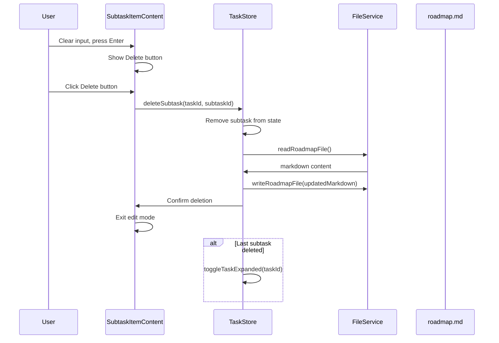

# Subtask Deletion Design

## Overview

Implement a feature to allow users to manually delete subtasks from the roadmap page by clearing the subtask input field and confirming deletion. This is the only way to delete subtasks on the page.

## Requirements

1. User can manually delete subtasks on the page
2. Clearing the subtask input and pressing Enter shows a delete confirmation
3. After confirmation, delete the subtask and sync to roadmap.md
4. When the last subtask is deleted, automatically collapse the parent task
5. This is the only way to delete subtasks on the page

## Design Decision

**Approach 1: Delete Button in Input Field**

When user clears the input field:
- A "Delete" button (Trash icon) appears inside the input field
- User clicks the Delete button to confirm deletion
- If user presses Enter on empty input, the input remains in edit mode showing the Delete button
- Delete button has a red/danger style for clarity

## Implementation Plan

### 1. Add Delete Subtask Function to Store

**File:** `roadmap-manager/src/store/taskStore.ts`

Add new action `deleteSubtask`:

```typescript
deleteSubtask: (taskId: string, subtaskId: string) => Promise<void>
```

Implementation:
- Find the task containing the subtask
- Remove the subtask from the task's subtasks array
- Update completedSubtasks count
- Read roadmap.md, remove the subtask line, write back to file
- Update store state

### 2. Add Markdown Utility Function

**File:** `roadmap-manager/src/utils/markdownUtils.ts`

Add new function:

```typescript
export function deleteSubtaskFromMarkdown(
  markdown: string,
  subtaskContent: string
): string
```

Implementation:
- Find the line containing the subtask content
- Remove the entire line
- Return updated markdown

### 3. Modify SubtaskItemContent Component

**File:** `roadmap-manager/src/components/SubtaskList.tsx`

Changes to `SubtaskItemContent`:

1. Add state:
   - `showDeleteButton: boolean` - true when editing and input is empty

2. Add Delete button UI:
   - Render Trash icon button inside input field when `showDeleteButton` is true
   - Button appears on the right side of input
   - Red/danger styling
   - OnClick: call `deleteSubtask(taskId, subtask.id)`, exit edit mode

3. Handle keyboard events:
   - On Enter key: if input is empty, prevent exit from edit mode, set `showDeleteButton(true)`
   - If input has content, existing behavior (update and exit)

4. Handle blur:
   - If input is empty, do NOT exit edit mode (user should delete via button)
   - Only exit on blur if input has content

### 4. Handle Last Subtask Collapse

**File:** `roadmap-manager/src/components/SubtaskList.tsx`

In the component, after successful deletion:
- Check if the task's subtasks array is now empty
- If empty, call `toggleTaskExpanded(taskId)` to collapse the parent

This can be done in the `deleteSubtask` callback or by watching subtasks length.

### 5. Import Required Icon

**File:** `roadmap-manager/src/components/SubtaskList.tsx`

Add Trash icon import:
```typescript
import { Check, Pencil, Trash } from 'lucide-react';
```

## Data Flow



## UI Mockup

```
[ ] Subtask content          [Pencil]
    ↓ User clicks pencil, clears input, presses Enter
[ ]                          [Trash] ← Delete button appears
    ↓ User clicks Trash
    → Subtask removed
    → roadmap.md synced
    → Parent task collapses if empty
```

## Edge Cases

1. **User presses Enter on empty without clicking Delete:**
   - Input remains in edit mode
   - Delete button stays visible
   - No deletion occurs

2. **User clicks outside (blur) on empty input:**
   - Input remains in edit mode
   - User must explicitly click Delete or restore content

3. **Task has only one subtask:**
   - After deletion, subtasks array is empty
   - Parent task is collapsed automatically

4. **Markdown file read/write fails:**
   - Show error message
   - Keep subtask in UI (don't remove from state)
   - Existing error handling pattern in store

## Files to Modify

1. `roadmap-manager/src/store/taskStore.ts` - Add deleteSubtask action
2. `roadmap-manager/src/utils/markdownUtils.ts` - Add deleteSubtaskFromMarkdown function
3. `roadmap-manager/src/components/SubtaskList.tsx` - Add Delete button UI and logic

## Testing Considerations

1. Delete button appears when input is empty
2. Delete button does NOT appear when input has content
3. Clicking Delete removes subtask from UI
4. roadmap.md is updated correctly
5. Parent task collapses when last subtask is deleted
6. Pressing Enter on empty input does not exit edit mode
7. Blur on empty input keeps edit mode active
8. Error handling when markdown write fails
